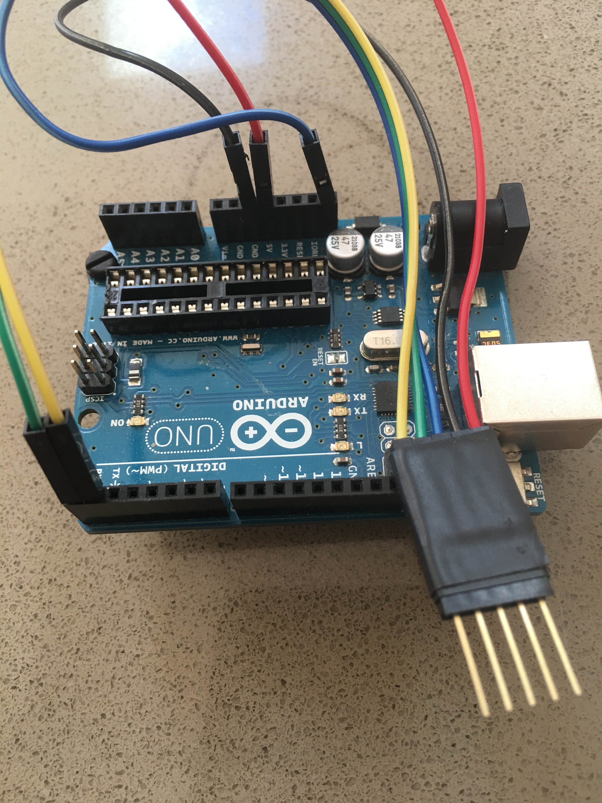

# Morse-Code-Trainer

This is the source code for my Morse Code Trainer. The device can be found on [Etsy](https://www.etsy.com/listing/563196561/morse-code-trainer)

## Programing Intructions

### Requirements

* An Arduino Uno
* The Arduino Software
* Header Pins
* Male to Male Jumper Wires

### Preparing The Arduino Uno

Remove the arduino chip and setup the hookup wires.

### Modify the Sketch

Open the sketch in the Arduino software and locate the following code and modify the messages.  Note messages mush be in capitals.

### Hookup the Arudino

The red wire in my images is 5v.

### Verify Arudino Settings

Connect the Arduno Uno to your computer with a usb cable. Make sure the arduino settings are the same as in the image below. Note the Port may be different.

### Upload Code to the Morse Code Trainer.

Press the check mark in the upper left of the Arduino software.  This will compile the new sketch and verify that there are no errors.

Next, Press the right arraw in the upper left to send the code to the device.

